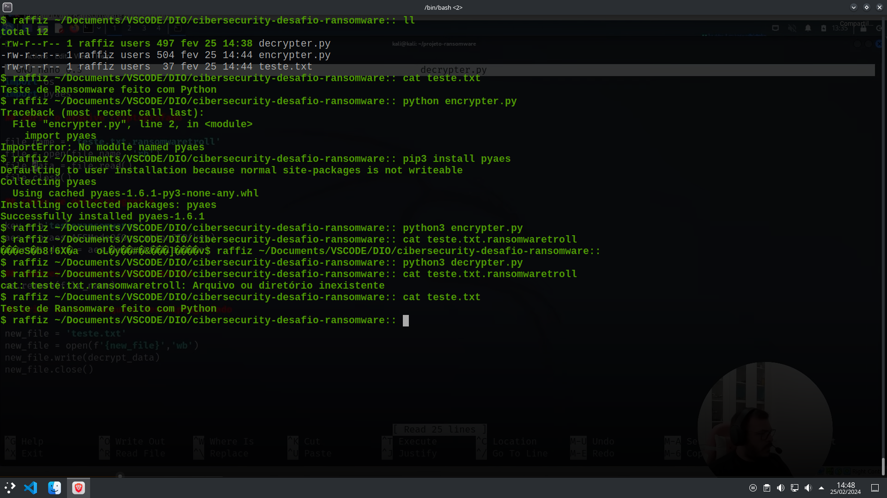

# Cibersecurity Desafio Ransomware

## Overview

Este projeto é uma solução para o desafio de segurança cibernética envolvendo ransomware. Ele oferece um conjunto de ferramentas e instruções para clonar o repositório, instalar dependências, executar a criptografia e descriptografia de arquivos, e resolver o desafio proposto.

## Ferramentas

- Python3
- pip3

## Processo de Clone

Para começar, você pode clonar o repositório da DIO-Cassiano usando o seguinte comando:

- git clone https://github.com/cassiano-dio/cibersecurity-desafio-ransomware.git

Ao clonar o repositório, observe que no arquivo encrypter.py pode haver um erro, que foi corrigido para execução.

A linha 22 originalmente era:
- new_file = open(f'{new_file}','wb')
E foi corrigida para:
- new_file = open(new_file,'wb')

## Instalação do pyaes
Antes de prosseguir, é necessário instalar a biblioteca pyaes:
- pip3 install pyaes

## Execução de Criptografia e Descriptografia

Após a preparação, você pode executar a criptografia e descriptografia dos arquivos. Certifique-se de editar o arquivo 'text.txt' conforme necessário.

Para criptografar o arquivo 'teste.txt' e criar um novo com o nome 'teste.txt.ransomwaretroll', utilize:
- python3 encrypter.py

Para descriptografar o arquivo, execute:
- python3 decrypter.py

### Importante!

O desafio proposto envolve a observação de detalhes importantes durante o processo de criptografia. Certifique-se de que a chave contenha exatamente 16 caracteres:

### chave de criptografia
- key = b"testeransomwares"

Além disso, ao localizar o arquivo a ser criptografado, é recomendável testar apenas com arquivos descartáveis e nunca usar arquivos do sistema em si:

### abrir o arquivo a ser criptografado
- file_name = "teste.txt"

## Resolução do Desafio!

#### Nota: Este projeto é apenas para fins educacionais. Utilize com responsabilidade e nunca aplique em ambientes de produção sem a devida autorização.

